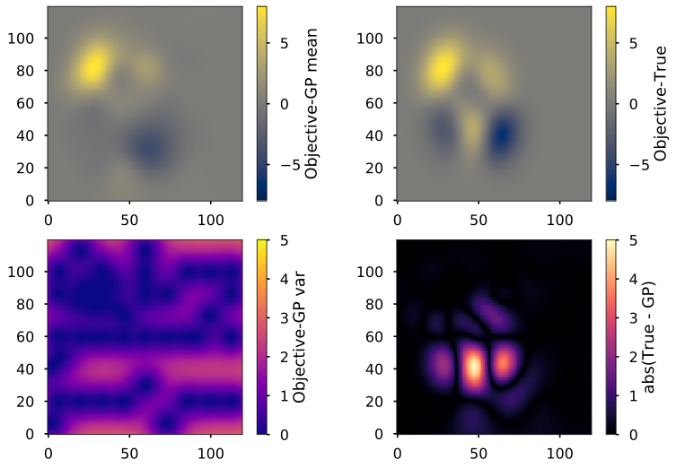
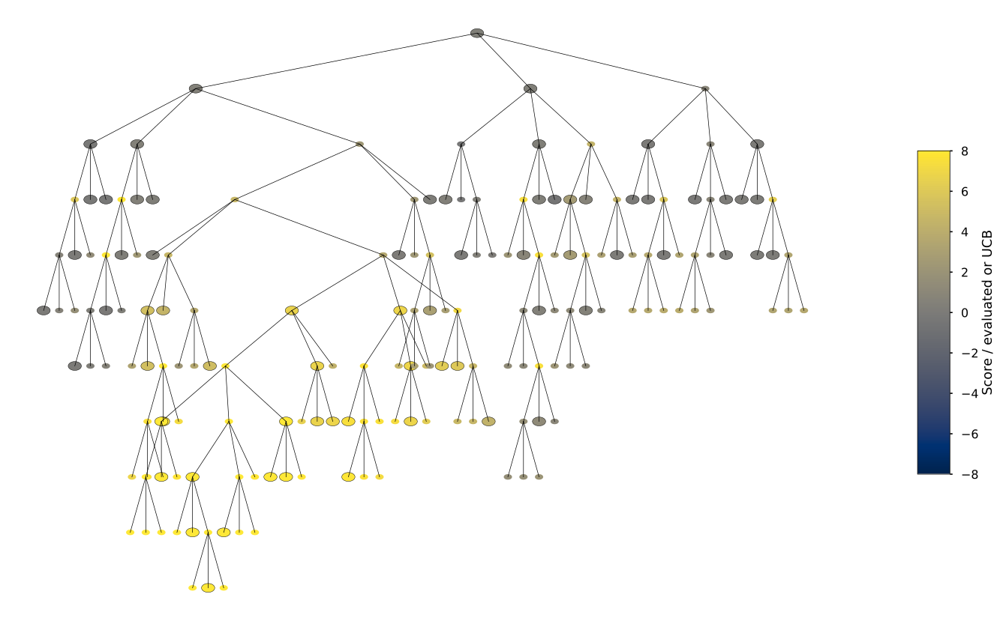

[](https://travis-ci.com/jajcayn/pygpso)  [](https://github.com/psf/black)

# pyGPSO
*Optimise anything (but mainly large-scale biophysical models) using Gaussian Processes surrogate*

`pyGPSO` is a python package for Gaussian-Processes Surrogate Optimisation. GPSO is a Bayesian optimisation method designed to cope with costly, high-dimensional, non-convex problems by switching between exploration of the parameter space (using partition tree) and exploitation of the gathered knowledge (by training the surrogate function using Gaussian Processes regression). The motivation for this method stems from the optimisation of large-scale biophysical models in neuroscience when the modelled data should match the experimental one. This package leverages [`GPFlow`](https://github.com/GPflow/GPflow) for training and predicting the Gaussian Processes surrogate.

This is port of original [Matlab implementation](https://github.com/jhadida/gpso) by the paper's author.

**Reference**: Hadida, J., Sotiropoulos, S. N., Abeysuriya, R. G., Woolrich, M. W., & Jbabdi, S. (2018). Bayesian Optimisation of Large-Scale Biophysical Networks. NeuroImage, 174, 219-236.

Comparison of the GPR surrogate and the true objective function after optimisation.
<p align="center">
  
</p>

Example of ternary partition tree after optimisation.
<p align="center">
  
</p>

## Installation

### One-liner
For those who want to optimise right away just
```bash
pip install pygpso
```
and go ahead! Make sure to check [example notebook](examples/optimisation_example.ipynb) how it works and what it can do.

### Go proper
When you are the type of girl or guy who likes to install packages properly, start by cloning (or forking) this repository, then installing all the dependencies and finally install the package itself
```bash
git clone https://github.com/jajcayn/pygpso
cd pygpso/
pip install -r requirements.txt
pip install .
```
Don't forget to test!
```bash
pytest tests/
```

## Usage
A guide on how to optimise using this package is given as a [jupyter notebook](examples/optimisation_example.ipynb).
The basic idea is to initialise the parameter space in which the optimisation is to be run and then iteratively dig deeper and evaluate the objective function when necessary
```python
from gpso.param_space import ParameterSpace
from gpso.optimisation import GPSOptimiser


def objective_function(x, y):
    ...
    <some hardcore computation>
    ...
    return <float>

# bounds of the parameters we will optimise
x_bounds = [-3, 5]
y_bounds = [-3, 3]
space = ParameterSpace(parameter_names=["x", "y"], parameter_bounds=[x_bounds, y_bounds])
opt = GPSOptimiser(parameter_space=space, n_workers=4)
best_point = opt.run(objective_function)
```

The package offers plotting functions for visualising the results. Again, those are documented and showcased in the [example notebook](examples/optimisation_example.ipynb).

## Known bugs and future improvements
* saving and resuming of the optimisation
    * right now the parameter space and its state can be saved into binary `pkl` file
    * however, the surrogate and its state cannot - this is mainly due to usage of `GPFlow` 2.0 which is not officially released as of now and hopefully this will change in the future (in `GPFlow` 2.0 the `saver` module from previous versions is missing)
    
    * the plan is to solve saving of the surrogate object and its state, then it will be easy to resume the optimisation from the saved state

## Final notes
When you encounter a bug or have any idea for an improvement, please open an issue and/or contact me.

When using this package in publications, please cite the original Jonathan's paper as
```bibtex
@article{hadida2018bayesian,
  title={Bayesian Optimisation of Large-Scale Biophysical Networks},
  author={Hadida, Jonathan and Sotiropoulos, Stamatios N and Abeysuriya, Romesh G and Woolrich, Mark W and Jbabdi, Saad},
  journal={Neuroimage},
  volume={174},
  pages={219--236},
  year={2018},
  publisher={Elsevier}
}
```
and acknowledge the usage of this package.
